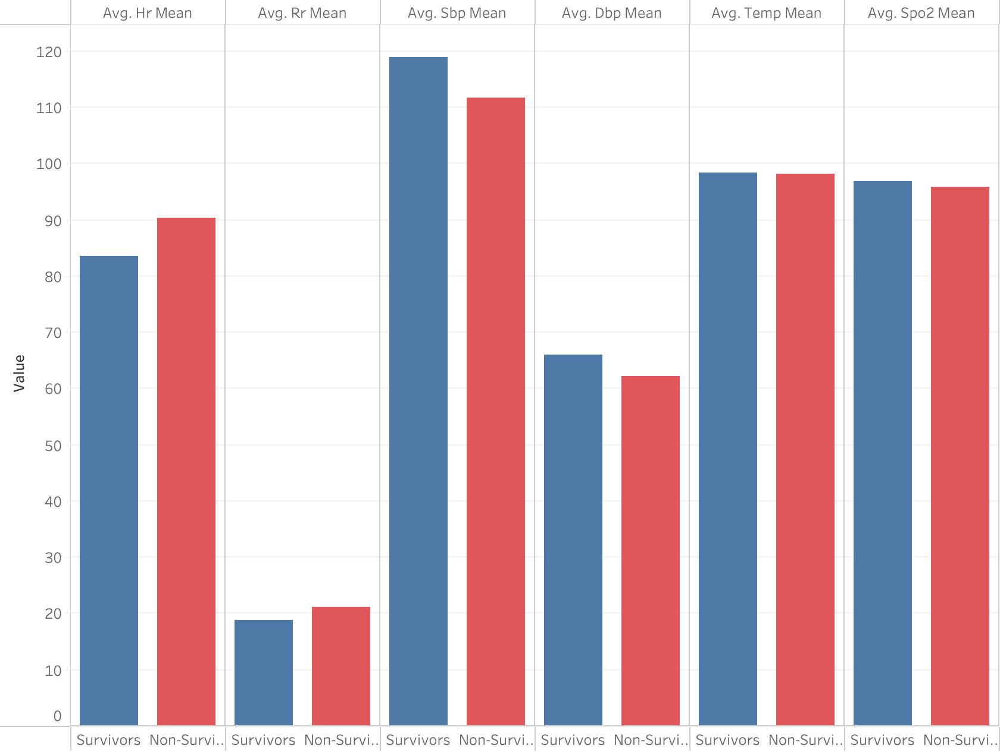
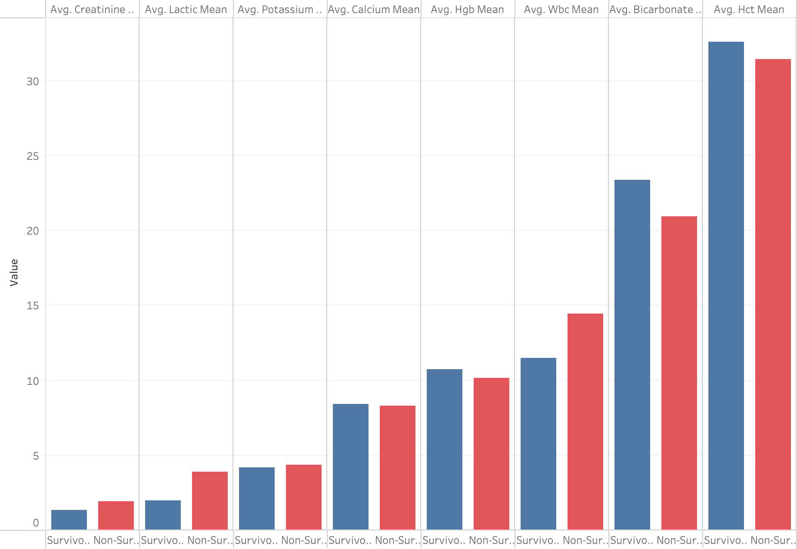
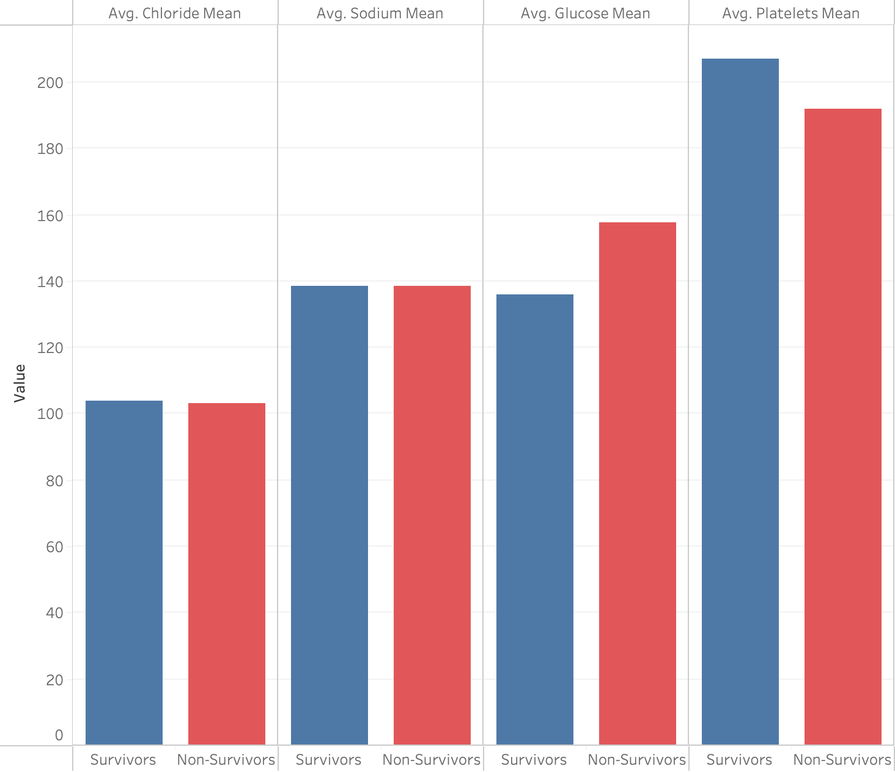
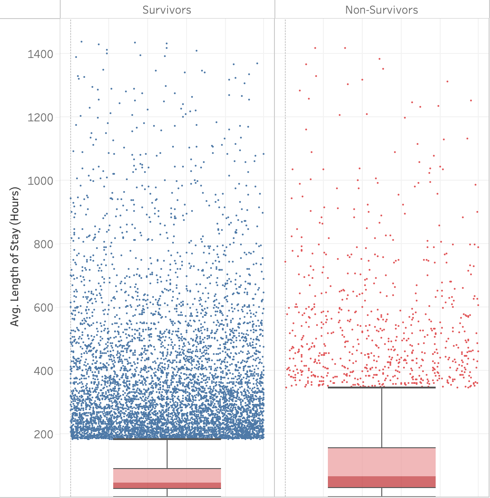

# ICU Mortality Early Prediction Using MIMIC-IV (v3.1)

## 1. Overview:

This project explores early vitals and labs to identify signals associated with in-hospital mortality among ICU patients using the [MIMIC-IV v3.1](https://physionet.org/content/mimiciv/3.1/) (`hosp`+ `icu` modules) dataset.

## 2. Research Questions:

- RQ1: How do early vital signs differ between survivors and non-survivors?
- RQ2: How do early laboratory values differ between survivors and non-survivors?
- RQ3: Which variables show the strongest association with mortality?
- RQ4: How does ICU length of stay differ between survivors and non-survivors?

## 3. Summary of Key Findings:

#### Vitals

- On average, non-survivors had **higher heart rates** (89 bpm vs 85 bpm) and **higher respiratory rates** (20.6 bpm vs 19.0 bpm)
- Non-survivors also had **lower blood pressure** (systolic and diastolic): 114/63 mmHg compared to 119/66 mmHg
- Oxygen saturation (SpO₂) and temperature (°F) were slighty lower but negligble for non-survivors (96.23% vs 96.79% and 98.21°F vs 98.29°F respectively)
- Overall, **respiratory rates** had the **highest** effect size on the two groups in terms of vitals, according to the calculations of Cohen's _d_ effect sizes.

#### Labs

- Notable differences in averages of lab results between the two groups include:
  - **Lactic acid, Creatinine, and Glucose levels were higher** in non-survivors: 3.35 mmol/L vs 1.96 mmol/L, 2.06 mg/dL vs 1.83 mg/dL, 158.5 mg/dL vs 148.8 mg/dL respectively
  - **Bicarbonate and Platelets levels were lower**: 20.92 mmol/L vs 22.84 mmol/L, 189.8 ×10³/µL vs 209.6 ×10³/µL
- Cohen's _d_ effect sizes show **platelets, glucose, sodium, bicarbonate** had the most significant difference betweeen non-survivors and survivors.

#### Length of Stay

- ICU length of stay showed **no meaningful difference** (Cohen’s d = 0.01, p = 0.887),
  meaning survivors and non-survivors stayed roughly similar durations.

## 4. References

1. Johnson, A., Bulgarelli, L., Pollard, T., Gow, B., Moody, B., Horng, S., Celi, L. A., & Mark, R. (2024). MIMIC-IV (version 3.1). PhysioNet. RRID:SCR_007345. https://doi.org/10.13026/kpb9-mt58
2. Johnson, A.E.W., Bulgarelli, L., Shen, L. et al. MIMIC-IV, a freely accessible electronic health record dataset. Sci Data 10, 1 (2023). https://doi.org/10.1038/s41597-022-01899-x
3. Goldberger, A., Amaral, L., Glass, L., Hausdorff, J., Ivanov, P. C., Mark, R., ... & Stanley, H. E. (2000). PhysioBank, PhysioToolkit, and PhysioNet: Components of a new research resource for complex physiologic signals. Circulation [Online]. 101 (23), pp. e215–e220. RRID:SCR_007345.

##### Data Use Notice:

_This repository does not contain any MIMIC-IV data or patient-level information.
All SQL queries, analysis scripts, and images are derived from aggregated results.
Access to MIMIC-IV requires credentialed approval through PhysioNet._
